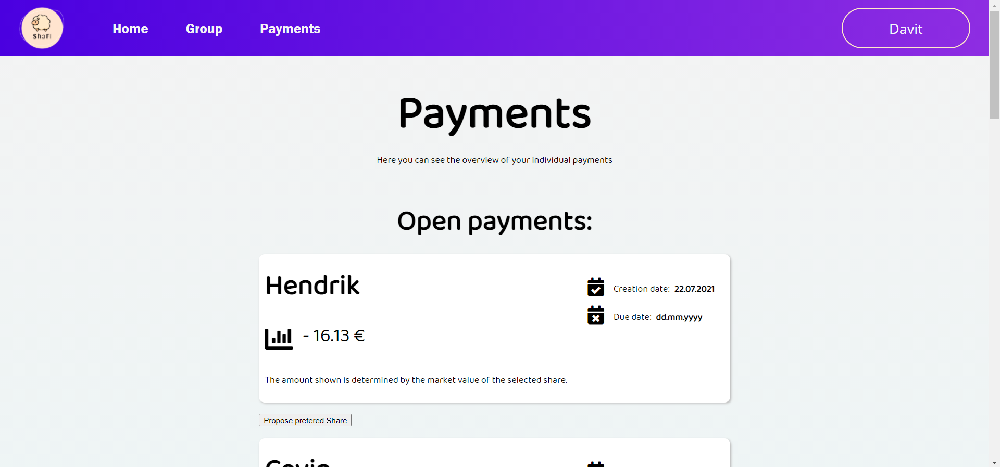

# SharedFinanze

 

# Screenshots

 

 

 

 

 

 

 

# Dokumentationen
1. [Dokumenation des Frontend](https://github.com/Davo00/aktien-app-frontend/tree/main/ShaFi#readme)
2. [Dokumentation des Backend](https://github.com/Davo00/aktien-app-backend/blob/main/README.md)
3. [Video für die Installation des Frontend](https://www.youtube.com/watch?v=ffVUVSiPxsY)
4. [Video für die Verwendung der App Teil 1](https://www.youtube.com/watch?v=0llMC2TA-Mg)
5. [Video für die Verwendung der App Teil 2](https://www.youtube.com/watch?v=hI-njaEO65k)

# Wichtige Links
1. [Die Webseite](http://162.55.185.65/)
2. [Das Backend](https://github.com/Davo00/aktien-app-backend)

